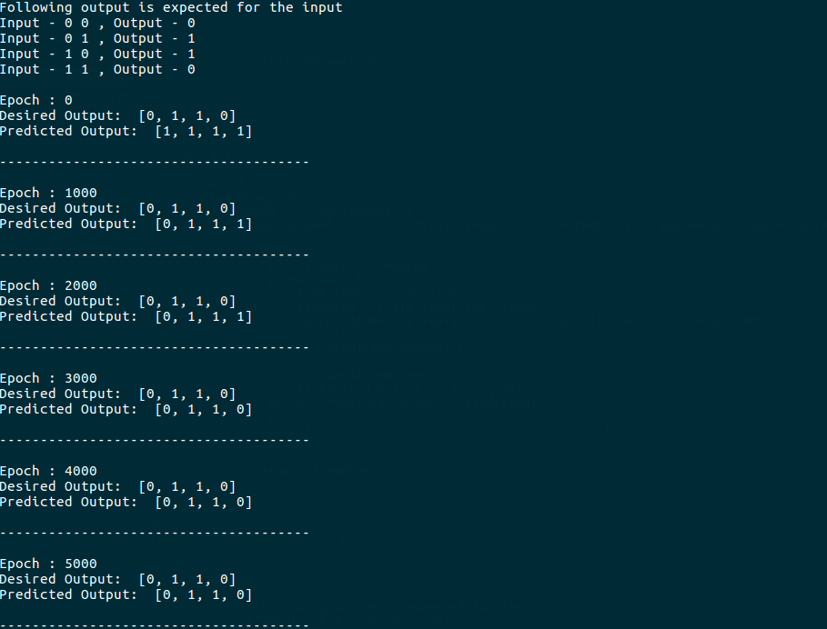

# XOR-Problem
This is my attempt to solve the XOR problem.

Implemented a entire neural network with vairable number of hidden layers (minimum 2) and with variable number of nodes in every hidden layer using the numpy library.

The entire backpropogation algorithm has also been implemented from scratch and has been used to solve the simple XOR problem.
